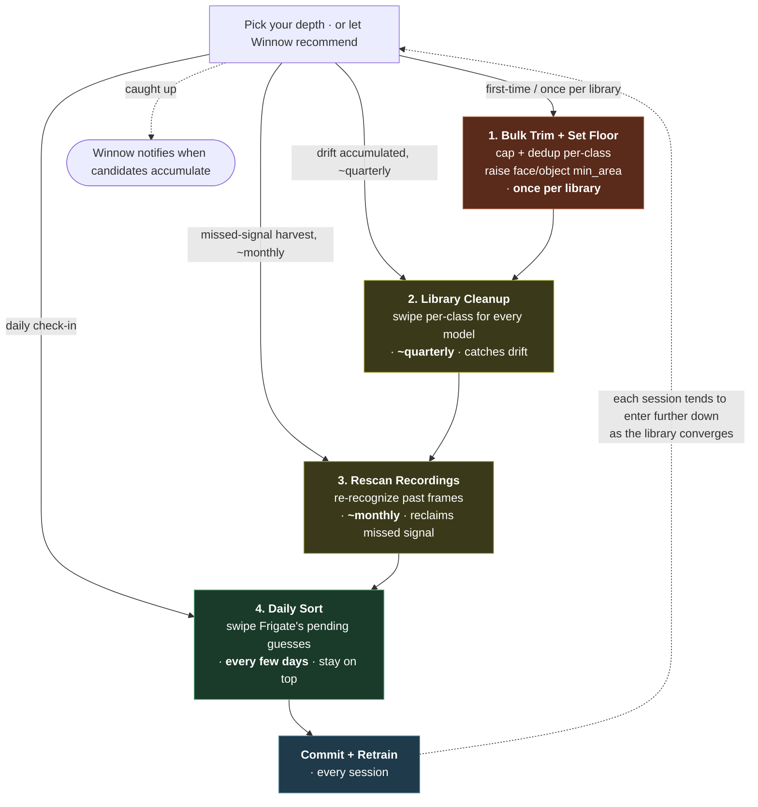

# ADR-0018: Winnow is a guided library-improvement pipeline, with a depth dial

- **Status:** Proposed
- **Date:** 2026-06-01
- **Supersedes the framing of:** ADR-0001 (single time-slice "swipe candidates"
  framing). The rest of ADR-0001 (model-assisted human-in-the-loop curation)
  remains the central principle — this ADR just states what we apply it *to*.

## Context (the pivot)
v0.1.0 shipped as *"a swipe-to-curate companion for Frigate"*. Through real
use the actual mission revealed itself, and it's bigger than that one-liner.

**The engine** — the swipe loop, the dpad, the unified Yes/Reassign/Reject
verdict, the user-triggered commit — is universal and stays. That's what v0.1
got right and what feels good to use.

**The product** is a level up: a *guided pipeline that walks a user through
dramatically improving their Frigate library*, with **sane defaults out of the
box** and a **depth dial** so a casual user gets meaningful gains in 10
minutes and a power user can drive the whole thing to convergence. The user
doesn't have to know what an event-snapshot vs a recording snapshot is, or
what ahash dedup means; they pick a depth, follow the guide, and their
Frigate gets sharper.

The work since v0.1 — ADRs 0015 / 0016 / 0017 — turned out to be the *four
slices* at which a Frigate library degrades, each one a tool in the pipeline:

| Slice | When library degrades | Tool | ADR |
|---|---|---|---|
| **1. Train pool** | Frigate has new candidates it isn't sure about | Sort | 0001/0008 |
| **2. Per-event volume** | Frigate captures dozens of near-duplicate frames | Event keep-set | 0015 |
| **3. Existing library** | High-confidence wrong matches bypassed review | Library cleanup | 0016 |
| **4. Past recordings** | Old recognition was poor; useful captures left on floor | Rescan | 0017 |

Slice 1 catches new noise before it lands. Slice 2 caps how much lands per
event. Slice 3 removes noise that landed anyway. Slice 4 reclaims signal that
was misidentified at capture and never made it in.

The pivot: these aren't four features bolted on a v0.1 — they're **one
pipeline** the user walks through, ordered, with depth control.

## The depth dial — entry points and cadence
Each stage's cadence is the *inverse* of its weight: the heaviest stage runs
**once per library**; the lightest runs **every few days**. So a user re-enters
the pipeline at the depth their library currently needs, *not* by walking it
top-to-bottom each session. Over time, as the library converges, sessions enter
further down — until a steady-state user is just doing the Daily Sort every
few days to catch drift in target buckets (people changing clothes, kids
growing, cars getting dirty / repainted, etc).

Multiple entry points are also how a user *bringing a partially-curated
library* enters: a library that already trimmed elsewhere walks in at "Library
Cleanup" or "Rescan"; a library auto-grown by Frigate enters at "Bulk Trim".
The pipeline doesn't assume Winnow grew the library — it accepts the library
wherever it is and proposes the next useful stage.

## The interface principle (proposed Tenet 7, #16)
A consequence of the pivot worth stating explicitly: **the dpad is the *safe
path* for the current decision, not a catalog of all possible verdicts.** The
system knows what would degrade detection (rejecting the last photo of a
sparse cluster; confirming a multi-face crop where face_register might pick
the wrong one; saying No on a high-confidence multi-class match where Reassign
is the right action). The interface adapts per candidate to surface only the
verdicts that help or are neutral.

## The pipeline is model-agnostic
Every stage applies identically across model types — **face_recognition,
sub_label classifiers (Dogs, Cars, …), and any future custom classification
model**. Faces and classifiers are two instances of the same pattern: capped,
diverse, correctly-labeled training data per identity. The pipeline doesn't
branch by model type; within each stage, work is *grouped* by model:

| Stage | Faces | Sub_label classifiers | Mechanism |
|---|---|---|---|
| Bulk Trim | clips/faces/<name>/ | clips/<model>/dataset/<class>/ | `eval/diversity_sample.py` (folder-agnostic) |
| Library Cleanup | per-person swipe | per-class swipe | ADR-0016 (already model-agnostic) |
| Rescan | `/api/faces/recognize` | offline `model.tflite` inference | ADR-0017 + variant |
| Daily Sort | face train pool | classifier train pool | same swipe loop |

The downstream UI consequence (the tabbed surface in #15) is **pipeline-stage
tabs, not model-type tabs**. The reviewer thinks "I'm doing library cleanup",
not "I'm targeting the Dogs model" — they see Dogs/Cars/Faces work side by
side within each stage, organized for them.

This unification retroactively justifies the source-agnostic core (ADR-0012):
*Frigate* is one adapter; the pipeline above is universal classification
curation that happens to plug into a specific NVR. A second adapter walks the
same pipeline.

## Decision (the adaptive interface)
**Adaptation by *omission*, not dimming.** A removed verdict becomes a
**blank, non-interactive cell of the same size and position** as the missing
button. The dpad's 5-cell grid (Undo / No / Reassign / Yes / Skip) is a
**stable layout**: ← always means No when present, → always means Yes when
present. Muscle memory is preserved across modes. A blank cell is a visible
signal that *the verdict has been deliberately removed for this decision* —
no mystery, no "why is this greyed out", no temptation to click anyway.

**Documented rule, not hidden magic.** Every adaptation is rooted in a
written-down rule the user can read in the workflow's docs ("On Rescan
cards: when multiple faces are detected in the crop, only Reject and Skip
are available — face_register can't pick which face to file, so neither of
us is allowed to guess"). The behavior is deterministic and explainable.

**Cards are constructed to make every decision meaningful.** If the natural
input unit doesn't admit a clear question, **decompose it** into units that
do. The human never sees an "ambiguous card" — they see one or more clean
cards, each asking a single answerable question.

The motivating example: a recording frame with two tracked people standing
close, where the per-person body crop *still* contains both faces. Naive
behavior would be one "multi-face" card with no safe verdict. Decomposed
behavior: run face detection on the crop (Frigate's own `facedet.onnx`,
available offline), find each face's box, crop tight to each, run
`/api/faces/recognize` per face, emit **one normal card per face** with the
full verdict menu. The reviewer answers two single-face questions instead of
one impossible multi-face one.

**Auto-filter is the true last resort.** It applies only when no
decomposition produces a meaningful decision — most commonly when no face is
detected in the crop at all (back-of-head, full occlusion, face below
threshold). The section header surfaces a counter for transparency
(*"829 emitted, 14 auto-filtered as no-face"*), with optional drill-in. This
is distinct from cards where only *one* action is available but that action
is **load-bearing** (e.g. Reject on an over-capped person — the only verdict,
but the verdict that actively improves the library). Single-load-bearing-
verdict cards stay surfaced; truly-no-signal cards do not.

This isn't a UI flourish — it's how an opinionated guided tool works. v0.1's
"five buttons, you decide" is the engine. v0.2's adaptive dpad — blank
cells, stable layout, documented rules — is the product.

The four slices (in order of Frigate's data pipeline):

| Slice | When | Symptom Winnow caught | ADR |
|---|---|---|---|
| **1. Uncommitted (the train pool)** | Frigate detected but isn't yet sure | "Is this Mario?" Y/N/Reassign | 0001/0008 |
| **2. Per-event volume** | Frigate captures many near-duplicate frames | "one card per event, keep N diverse" | 0015 |
| **3. Already-committed (the library)** | High-confidence wrong matches bypass review | "Luigi → Mario" mis-commits poisoning Mario | 0016 |
| **4. Could-have-been-committed (recordings)** | Past recognition was poor → useful captures left on the floor | re-recognize stored frames; harvest with a human gate | 0017 |

Stack them and you get a pipeline diagram of where training data quality is
*actually* born and lost. Slice 1 catches new noise before it lands. Slice 2
caps how much new noise lands per event. Slice 3 removes the noise that landed
anyway. Slice 4 reclaims the *signal* that was misidentified at capture time
and never made it into the library.

## Decision
**Reframe Winnow's mission, scope, and UI around the curation spectrum:**

- **Mission (one line):** *"continuously improve a Frigate instance's training
  data — across every time slice where it can degrade."* (Not "swipe.")
- **The product surfaces three workflows that reflect the slices:**
  - **Sort** — the daily review (slice 1, with the slice-2 event-level keep-set
    baked in). What v0.1 was.
  - **Library cleanup** — slice 3. ADR-0016.
  - **Rescan** — slice 4. ADR-0017.
  - Each is a *workflow*, not a feature. Each commits through the same
    Yes/Reassign/Reject vocabulary into the same `verdicts.jsonl` and the same
    user-triggered commit. Underlying machinery doesn't fork.
- **A fourth surface — Settings — exposes the tuning knobs** that today are
  env-var-only (WINNOW_KEEP_PER_EVENT, WINNOW_MAX_PER_IDENTITY when #8 lands,
  WINNOW_NO_COMMIT, rescan window/confidence/pad), alongside read-only context
  for Frigate's own knobs (face_recognition.{min_area, recognition_threshold,
  unknown_score}) that materially shape what arrives at slice 1 in the first
  place. Makes the tool usable by humans who don't write YAML.
- **The README, TENETS, and ADR-0001's "Context" section get rewritten** so a
  newcomer reads the spectrum first and understands why the three workflows
  exist *together*. The Tenets stay the same — they were always
  spectrum-correct ("capture signal, never silently discard it" especially);
  only the framing on top of them changes.
- **The tabbed UI (#15) is the visual consequence** of this thesis, not the
  cause. It comes from "three workflows" being real, not from a UX whim.

## Consequences
- Naming: "Winnow" still fits — the act of separating signal from noise across
  every place it accumulates. (We won't rename.)
- The v0.2 milestone is now coherent: ship a Winnow that can take a stranger's
  badly-curated Frigate library and a few hours of attention and *measurably*
  improve detection quality across the whole pipeline. That's a much sharper
  positioning than "Tinder for Frigate".
- ADR-0001 isn't superseded — it stays as the human-in-the-loop principle.
  We're just explicit that "candidates" was always too narrow a noun for what
  the loop applies to.
- Concrete v0.2 scope: README rewrite + tabbed UI (#15) + Settings tab + the
  cross-event diversity sampler (#8) + the per-event high-confidence-bias fix
  (#9), all framed around the spectrum. Validation of the trim (#5) becomes
  the credibility anchor — "this isn't theory, here are the numbers."

Tenets unchanged. This is a framing ADR, not a behavior one — it codifies
something that was true since ADR-0015 but had stayed unnamed. Naming it makes
the next several decisions easier (e.g. the tabbed UI's structure now writes
itself).
