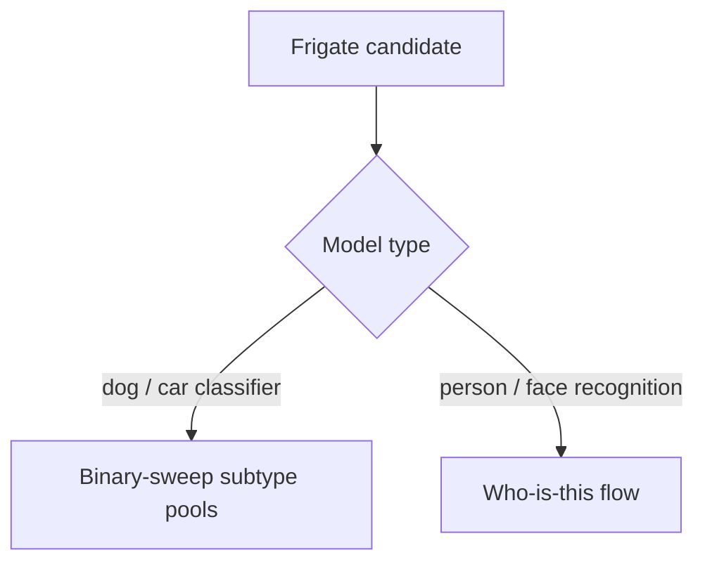
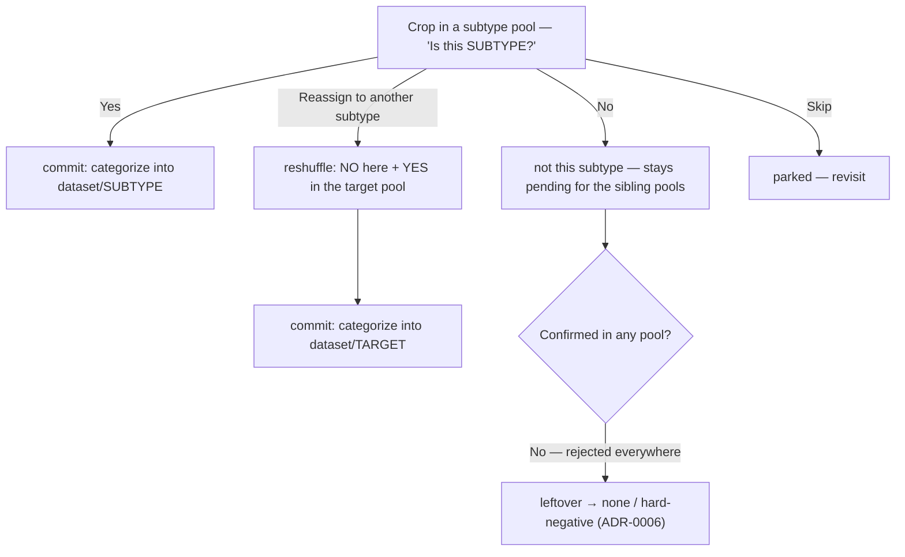
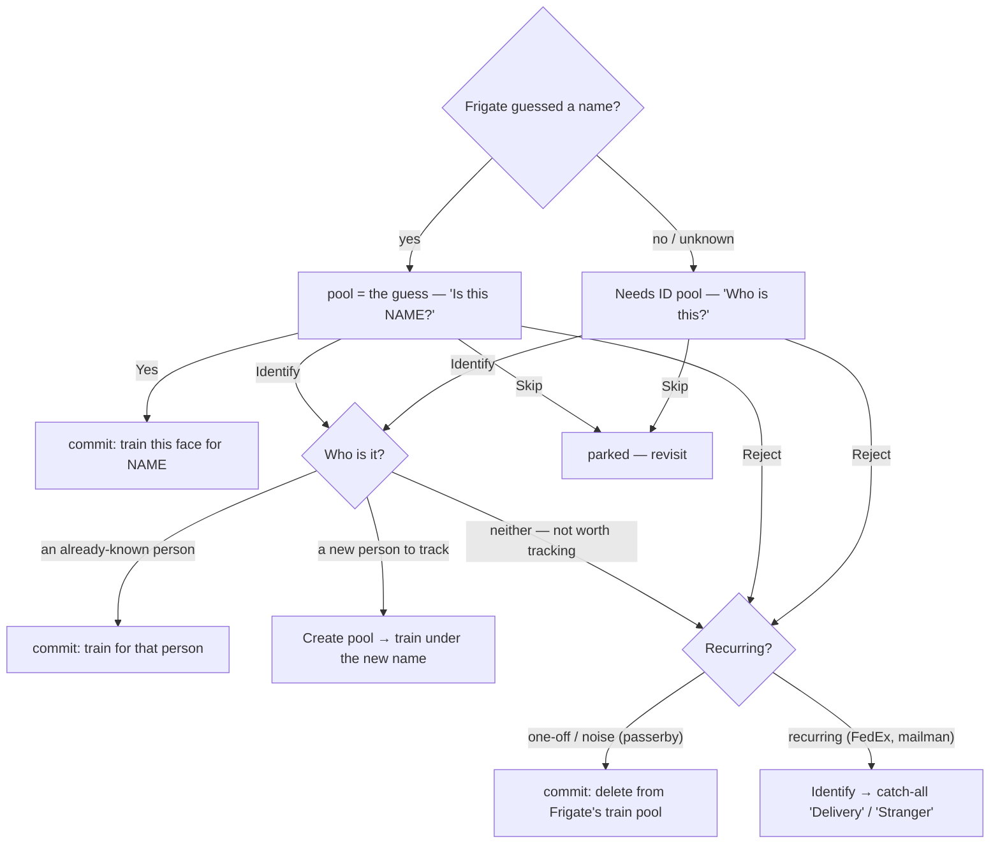

# Decision flows (Frigate adapter)

How a candidate moves through review for each Frigate model type, per the verdict
model in [ADR-0014](adr/0014-verdict-model-reassign-first-class.md). Verdicts are
local until you **commit** (ADR-0013); the "commit:" boxes are what a commit pushes.

## Which path?

## Classifier (dogs / cars) — binary-sweep

The same crop is a sibling candidate in every subtype pool. "No" leaves it for the
other pools; reassign reshuffles it (no here, yes there).

## Face recognition (people) — "who is this?"

Reassign is first-class. Frigate's unrecognized ("unknown") faces are surfaced for
identification rather than dropped — they merge with human-rejected guesses into a
**Needs ID** pool. Nothing Frigate detected is silently lost.

**The key branch** (your point): an unrecognized face is *known* → identify to that
person; or the *seed of a new pool* → create; or *neither* → reject. "Reject" is the
residual after ruling out both — and a recurring non-household face (FedEx) is worth
its own catch-all bucket rather than rejecting it every visit.
